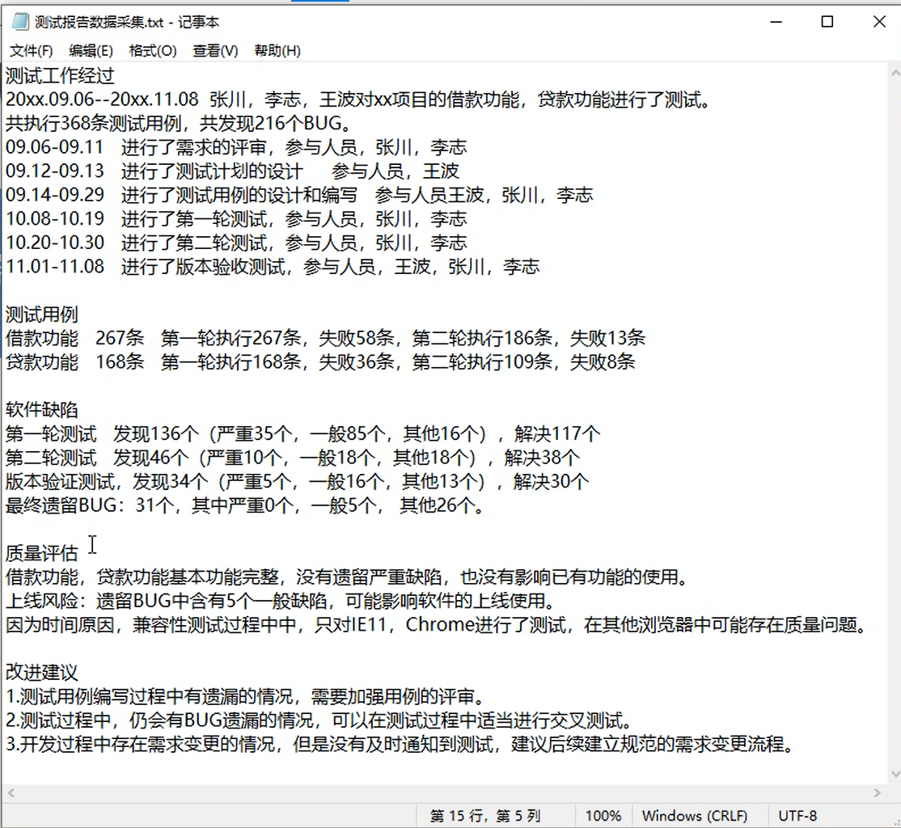

# 软件测试报告编写

## 什么事软件测试报告
总结文档：
1. 过程
2. 结果
3. 问题
4. 改进

软件测试报告包含**软件测试过程、结果、问题、改进的总结文档**。

## 为什么编写测试报告

汇报：汇报近期的测试工作

评估：通过测试结果评估软件质量

反思：通过复盘，思考如何改进工作

## 谁来编写测试报告
- 测试负责人（测试报告针对整个小组的测试报告，把这个报告一部分编写指派给一个小组成员完成）；

- 测试结束时编写；

- 参照以往模板；

## 软件测试小结
1. 软件测试报告：包含过程、结果、问题、改进的总结文档
2. 为什么编写测试报告：汇报、评估、反思
3. 谁来编写测试报告：测试负责人在测试结束时，参照模板进行编写

## 软件测试报告的核心内容
1. 测试工作的经过 
2. 用例和缺陷
3. 软件的质量评估
4. 工作的改进和建议

## 软件测试报告的编写步骤
1. 制作模板
2. 收集、汇总材料
3. 编写报告

## 测试报告编写-制作模板
一般是在word文档中编写，或者直接在邮件中显示
```doctest
XXX项目测试报告

1.概述
2.测试工作经过
3.测试用例
4.软件缺陷
5.质量评估
6.改进建议
```

## 软件测试编写-收集材料


