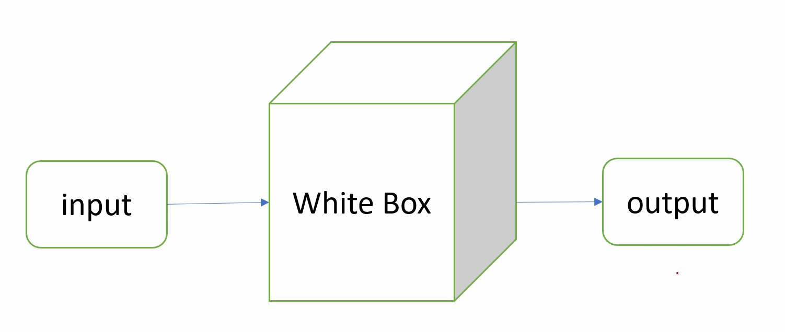
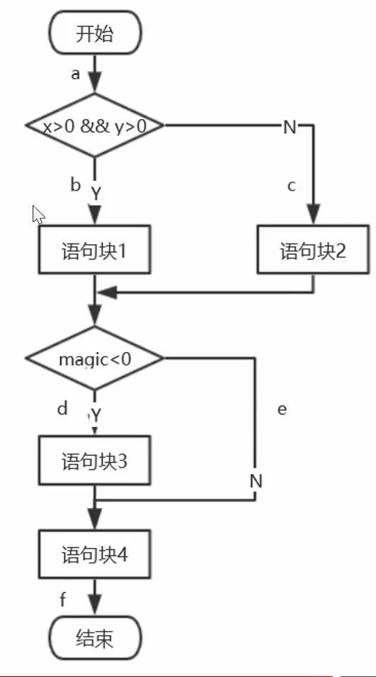
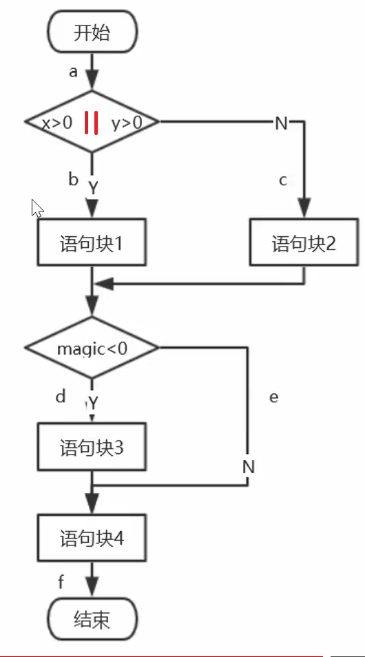
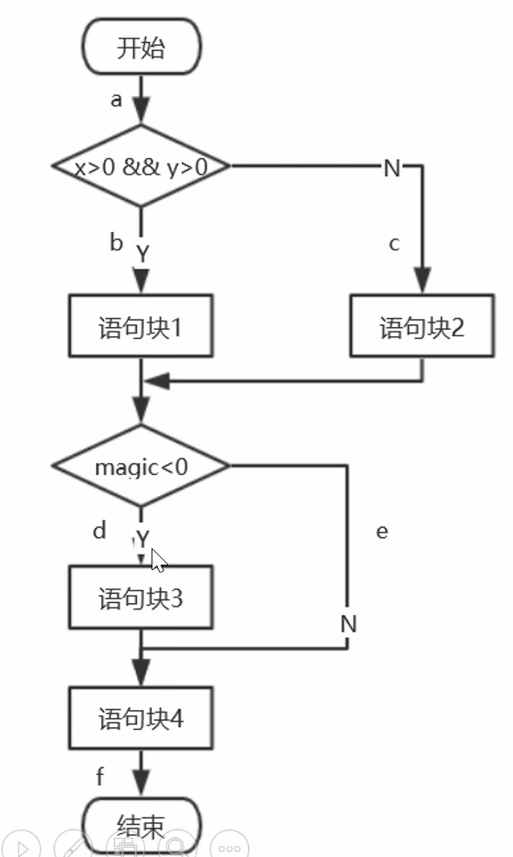
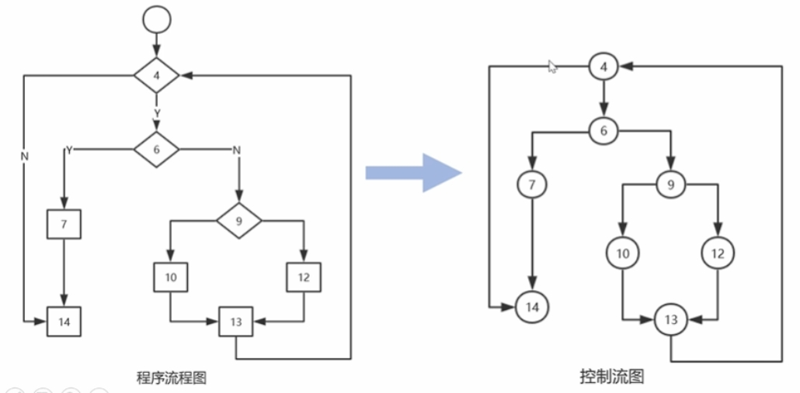
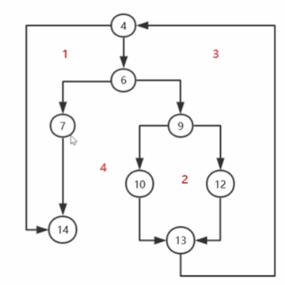

发现csdn上有类似笔记：[https://blog.csdn.net/weixin_64476458/article/details/123561070](https://blog.csdn.net/weixin_64476458/article/details/123561070)

# 白盒测试用例设计


语句覆盖、判定覆盖、条件覆盖、条件判定组合覆盖、多条件覆盖和修正判定条件覆盖。


## 白盒测试的概念和特点



白盒测试的特点：
- 优点
  - 代码覆盖率高
- 缺点
  - 覆盖所有代码路径难度大
  - 业务功能可能覆盖不全
  - 测试开销大

## 白盒测试方法的介绍

- 静态设计方法：不执行代码
  - 桌面检查：交叉检查，一个人检查
  - 代码审查：与桌面检查相比，更正式些，一般**会议**，作者讲解代码，与会人审查，关注代码结构规范
  - 代码走查：与代码审查相比，都是会议，代码走查，则是与会人提前准备测试用例，输入数据，看看数据走向，关注功能实现问题
  - 代码扫描工具：根据规则扫描代码，大大减小评审过程中、对于代码规范的时间，不能完全替代前面的3种方式  
- 动态设计方法：执行代码
  - **逻辑覆盖法**
    - 语句覆盖
    - 判定覆盖
    - 条件覆盖
    - 判定条件覆盖
    - 条件组合覆盖
    - 路径覆盖
  - **基本路径测试法**

### 逻辑覆盖法

**逻辑覆盖法**：是通过对程序逻辑结构的遍历实现程序的覆盖。

**覆盖率**：是用来度量测试完整性的一个手段。

$$ 覆盖率 = \frac{至少被执行一次的item数}{item的总数} $$

至少被执行一次的item数:覆盖的次数累加

**案例**

观察下面代码，如何对下面的代码进行覆盖测试。

```c
int logicExamle(int x, int y, int magic) {
  int A = 0;
  if(x>0 && y>0){
    A = x + y + 10;
  }else {
    A = x + y - 10;
  }
  if(magic < 0) {
    A = 0;
  }
  return A;
}
```
将代码转化为程序流程图：



#### 语句覆盖

语句覆盖：设计测试用例，使得程序中**每条语句至少被执行一次**。

$$ 语句覆盖率 = /frac {至少被执行一次的语句数量} {可执行的语句总数} $$

例如：案例代码中共有4条可执行语句，设计测试用例执行了3条，语句覆盖率为$3/4=75%$。

以刚刚的代码为案例，**语句全覆盖**（100%覆盖率），设计测试用例：

| 数据  | 语句 |
|--------|--------|
| {x=3,y=1,magic=2}  | 1、4  | 
| {x=-3,y=-1,magic=-2}  | 2、3、4  |

**局限性**

六种逻辑覆盖标准中，语句覆盖标准最弱的。

当代码写错变为`if(x>0 || y>0)`时，看流程图：



语句覆盖还是会走完所有语句，但并不能发现这个判断语句这个代码写错了。


#### 判定覆盖
**判定覆盖**：页脚分支覆盖，设计测试用例，使得程序中的每个判断的“真”和“假”都至少被执行一次，即：程序中的每个分支至少执行一次。

$$ 判定覆盖率 = /frac{每个判定的真假至少出现一次}{判定结果的总数}$$

例如：案例代码中有判定2个，判定结果4个
，设计测试用例执行了3个分支，分支覆盖率为$3/4=75


判定定义如下：

（1）`if(x>0 && y>0)`,记为P1

（2）`if(magic < 0)`,记为P2


测试用例设计（100%判定覆盖）：

| 数据  | P1 | P2 |
|--------|--------|--------|
| {x=3,y=1,magic=2}  | T  | F |
| {x=-1,y=0,magic=-2}  | F | T  | 

**局限性**

只要满足了判定覆盖标注就一定满足语句覆盖标准。
 
当代码写错变为`if(x>0 || y>0)`时，无法发现这个bug。判定覆盖会忽略条件中取或(or)的情况。

#### 条件覆盖
**条件覆盖**:设计测试用例，使得判定中的每个条件至少有一次取真值，有一次取假值。

$$ 条件覆盖率 = \frac {每个条件真假值至少出现一次}{条件结果的总数}$$

例如：案例代码中有判定2个，条件3个，条件结果6个。设计测试用例执行了5个条件结果，条件覆盖率为$5/6=83%$

判定条件定义如下：

（1）`if(x>0 && y>0)`判定：记为P1

（2）`if(magic < 0)`判定：记为P2

（3） `x > 0`：记为C1

（4）`y > 0`：记为C2

（5）`magic < 0`：记为C3


测试用例设计：

| 测试数据  | C1 | C2 | C3 |P1 | P2 |  路径 |
|--------|--------|--------|--------|--------|--------|--------|
| {x=3,y=1,magic=-2}  | T  | F | T  | F | T | a-c-d-f |
| {x=-3,y=15,magic=2}  | F | T  | F  | F | F | a-c-e-f |





**局限性**

条件覆盖比判定覆盖，增加了对判定中所有条件的测试。

| 测试数据  | C1 | C2 | C3 |P1 | P2 |  路径 |
|--------|--------|--------|--------|--------|--------|--------|
| {x=3,y=0,magic=-2}  | T  | F | T  | F | T | a-c-d-f |
| {x=-3,y=15,magic=2}  | F | T  | F  | F | F | a-c-e-f |

P1为真未覆盖。

条件覆盖并不能保证判定覆盖。

#### 判定条件覆盖
**判定条件覆盖**：设计测试用例，使得被测试程序中的每个判断本身的判定结果（真假）至少满足一次，同时，每个逻辑条件的可能值（真假）也至少被满足一次。即同时满足100%判定覆盖和100%条件覆盖的标准。

$$ 判定条件覆盖率 = /frac{每个判断真假值和条件真假值至少出现一次}{判定结果的总数+条件结果的总数}$$

例如：案例条件中判定2个，条件3个，判定结果4个，条件结果6个。设计测试用例执行了3个判定结果，5个条件结果，判定条件覆盖率为$(3+5)/(4+6)=80%$。


判定条件定义如下：

（1）`if(x>0 && y>0)`判定：记为P1

（2）`if(magic < 0)`判定：记为P2

（3） `x > 0`：记为C1

（4）`y > 0`：记为C2

（5）`magic < 0`：记为C3

| 测试数据  | C1 | C2 | C3 |P1 | P2 |  路径 |
|--------|--------|--------|--------|--------|--------|--------|
| {x=3,y=3,magic=2}  | T  | T | F  | T | F | a-b-e-f |
| {x=-3,y=0,magic=-2}  | F | F | T | F | T | a-c-d-f |


**局限性**

满足判定条件覆盖标准一定能够满足条件覆盖、判定覆盖和语句覆盖。

判定条件覆盖 会忽略条件中取或（or）的情况。

| 测试数据  | C1 | C2 | C3 |P1 | P2 |  路径 |
|--------|--------|--------|--------|--------|--------|--------|
| {x=3,y=3,magic=2}  | T  | T | F  | T | F | a-b-e-f |
| {x=-3,y=0,magic=-2}  | F | F | T | F | T | a-c-d-f |


## 条件组合覆盖

**条件组合覆盖**：设计测试用例，使得被测试程序中的每个判定中条件结果的所有可能组合至少执行一次。

$$ 条件组合覆盖率 = /frac{条件组合至少出现一次的数量}{条件组合的总数}$$

例如：案例代码中有判定2个，条件3个（判定1有2个条件，判定2有1个条件），判定1的条件组合为4个，判定2的条件组合为2个。设计测试用例执行了5个条件组合，条件组合覆盖率为：$5/(4+2)=83%$

判定条件定义如下：

（1）`if(x>0 && y>0)`判定：记为P1

（2）`if(magic < 0)`判定：记为P2

（3） `x > 0`：记为C1

（4）`y > 0`：记为C2

（5）`magic < 0`：记为C3

100%条件组合覆盖率

| 测试数据  | C1 | C2 | C3 |P1 | P2 |  路径 |
|--------|--------|--------|--------|--------|--------|--------|
| {x=3,y=0,magic=-2}  | T  | F | T  | F | T | a-c-d-f |
| {x=-3,y=15,magic=2}  | F | T | F | F | F | a-c-e-f |
| {x=3,y=3,magic=2}  | T | T | F | T | F | a-b-e-f |
| {x=-3,y=0,magic=-2}  | F | F | T | F | T | a-c-e-f |

**局限性**
所有路径不能达到全覆盖。

条件组合覆盖能满足判定覆盖、条件覆盖、判定条件覆盖，也就是包括语句覆盖。

#### 路径覆盖
路径覆盖：设计测试用例，覆盖程序中所有可能的路径。

$$ 路径覆盖率 = \frac{至少被执行过一次的路径数}{总的路径数} $$

判定条件定义如下：

（1）`if(x>0 && y>0)`判定：记为P1

（2）`if(magic < 0)`判定：记为P2

（3） `x > 0`：记为C1

（4）`y > 0`：记为C2

（5）`magic < 0`：记为C3

100% 路径覆盖

| 测试数据  | C1 | C2 | C3 |P1 | P2 |  路径 |
|--------|--------|--------|--------|--------|--------|--------|
| {x=3,y=3,magic=-2}  | T  | T | T  | T | T | a-b-d-f |
| {x=-3,y=3,magic=-2}  | F | T | T | F | T | a-c-d-f |
| {x=3,y=3,magic=2}  | T | T | F | T | F | a-b-e-f |
| {x=-3,y=15,magic=2}  | F | T | F | F | F | a-c-e-f |

**局限性**

仔细看出C2为假是没有被覆盖的,

路径覆盖可以对程序进行彻底的测试，比前面五种覆盖更广。

但是满足路径覆盖，并不一定能满足条件覆盖，也就不能满足条件组合覆盖。

### 基本路径覆盖法

**基本路径测试法**：在程序控制流图的基础上，通过分析程序的环路复杂度，导出基本可执行路径集合，从而设计测试用例。

基本路径测试法步骤：

1. 根据代码画出程序控制流图
2. 计算程序的环路复杂度
3. 导出可执行路径
4. 设计测试用例

案例：
看代码
```c
void sort1(int iRecordNum, int iType) {
  int x = 0;
  int y = 0;
  while (iRecordNum-- > 0) {
    if (iType == 0) {
      x = y + 2;
      break;
    } else if (iType == 1) {
      x = y + 10;
    } else {
      x = y + 20;
    }
  }
}

```
（1）画出程序流程图



（2）计算程序的环路复杂度



- 流程图中区域的数量，红色标出区域4个。
- 给定流图G的圈复杂度V(G)，定义$V(G) = E - N + 2 = 边数-结点数+2$，E是流图中边的数量。上图：V(G)=10-8+2。
- 给定流图G的圈复杂度V(G)，定义为$V(G)= P + 1 = 判定结点数 + 1$，V(G)=3+1，这里的判定结点为：代码中的4、6、9等三个结点。

（3）导出可执行路径

上图的导出路径为：

- 路径1：4-14
- 路径2：4-6-7-14
- 路径3：4-6-9-10-13-4-14
- 路径4：4-6-9-12-13-4-14

（4）设计测试用例

需覆盖的测试路径：（3）中的导出路径

| 测试数据  | 预期结果 | 覆盖路径 |
|--------|--------|--------|
| iRecordNum = 0 | x = 0 | 4-14 | 
| iRecordNum = 1, iType = 0 | x = 2 | 4-6-7-14 | 
| iRecordNum = 1, iType = 1 | x = 10 | 4-6-9-10-13-4-14 | 
| iRecordNum = 1, iType = 2 | x = 2 | 4-6-9-12-13-4-14 | 

## 白盒测试用例设计方法总结

- 主要应用于单元测试阶段
- 先静态、后动态
- 设计用例一般使用基本路径测试，重点模块使用多种覆盖率标准
